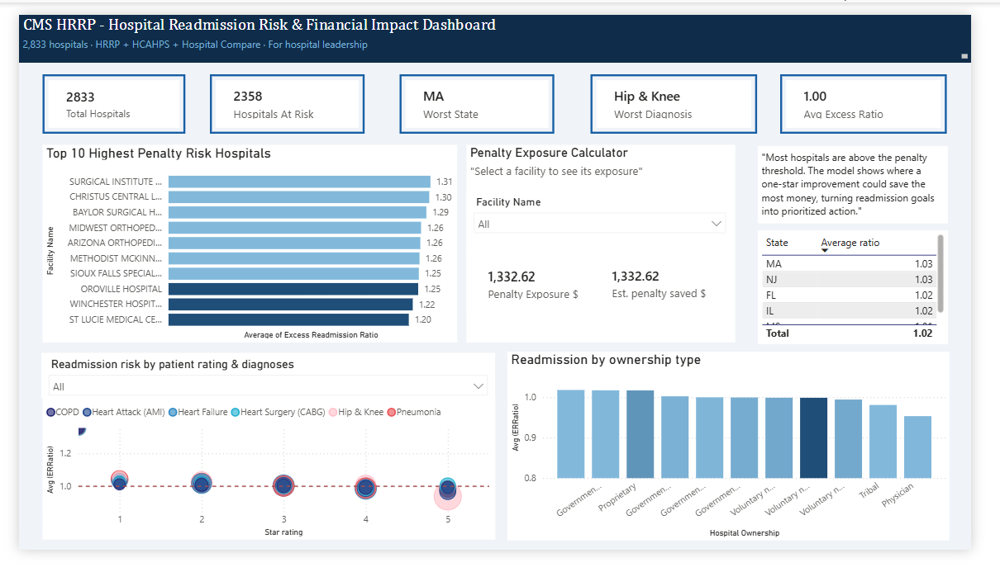

# Hospital Readmission Penalty Risk

A Power BI tool that shows hospitals where fixing readmissions saves the most money.

Medicare's Hospital Readmissions Reduction Program (HRRP) can cut a hospital's
payments by up to 3% when too many patients are readmitted within 30 days. This
project pulls together readmission, quality, and ownership data for 2,833
hospitals and models each one's penalty risk in dollars, so hospital leaders can
see not just *which* readmissions are high, but *where improving pays off most*.



---

## Key findings

- **83% of hospitals are at risk.** 2,358 of 2,833 hospitals are already above
  the line where penalties begin.
- **Massachusetts is the worst state** when ranked by average readmission
  severity (not just raw hospital count).
- **Hip and knee replacements** are the worst-performing condition across the
  board.
- **Physician-owned and tribal hospitals** outperform government-run and
  for-profit hospitals.

---

## What's in this repo

| Folder | Contents |
|--------|----------|
| `dashboard/` | The Power BI source file (`.pbix`) |
| `dax/` | The DAX measures behind the penalty calculator and rankings |
| `docs/` | The full case study (PDF) |
| `images/` | Dashboard screenshot |

The full write-up, including the methodology, the analytical decisions, and the
limitations, is in [`docs/HRRP_Case_Study.pdf`](docs/HRRP_Case_Study.pdf).

---

## How the penalty model works

The core of the dashboard is a calculator built in DAX. It estimates a
hospital's penalty risk and the savings from a one-star quality improvement:

```
Penalty Risk  = (Excess Ratio - 1.0) x Medicare Revenue x 3%
Penalty Saved = MIN(Excess Ratio - 1.0, 0.020) x Medicare Revenue x 3%
```

The full measures, with explanations, are in [`dax/measures.md`](dax/measures.md).

---

## A note on the model

These are estimates, not Medicare's exact penalty figures. The model uses
Medicare's real penalty mechanics with a few deliberate simplifications (a
standardized revenue figure, a single benchmark, and unweighted state averages).
The [case study](docs/HRRP_Case_Study.pdf) explains each one and what a
production version would do differently.

---

## Data sources

- CMS Hospital Readmissions Reduction Program (HRRP) data
- HCAHPS patient experience scores and hospital star ratings
- CMS Hospital Compare ownership data

## Tools

Power BI · DAX · data modeling

---

**Swathishri Balachandar** — Healthcare operational analytics
